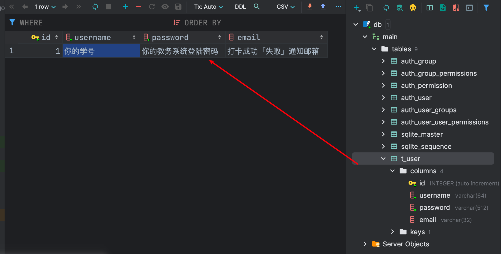
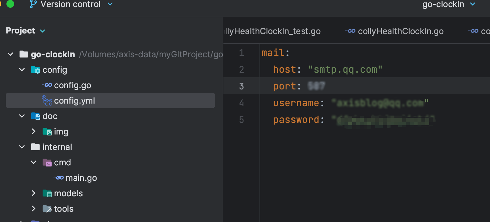
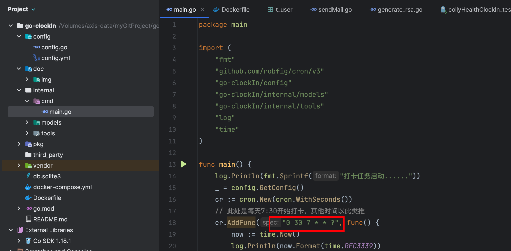
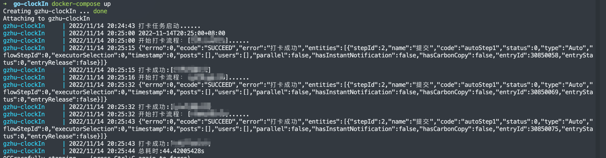

## go-clockIn

### Notice！！！由于国内yq形式好转，本项目开始Archive了

### 功能描述

> 采用golang编写的轻量级广州大学自动打卡系统，在使用docker部署项目的情况下，相较于python的部署大小为1个G左右，本系统的部署大小仅为34M，可以是说是非常轻便了。

### 技术栈

>1. colly：golang爬虫框架
>2. goja：在golang中执行javascript代码
>3. viper：项目配置管理
>4. cron：golang定时任务框架
>5. gomail：发送打卡结果通知邮件
>6. gorm：golang的orm框架
>7. Sqlite3: 离线数据库，保存要进行打卡的账号信息

### 食用指南

1. 录入要进行打卡的账号信息
   

2. 配置发送通知邮件的邮件服务「可使用qq邮箱、网易邮箱等的邮件服务」
   
3. 设定每天自动打卡的时间
   
4. 启动服务

4.1.  拉取代码仓库

```shell
$ git clone https://github.com/AxisZql/go-clockIn
```

4.2 构建并启动镜像

```shell
$ cd go-clockIn
$ docker-compose build # 构建时间可能比较长，请耐心等待⌛️
$ docker-compose up
## output
gzhu-clockIn     | 2022/11/14 20:32:15 打卡任务启动......
```

### 运行效果




